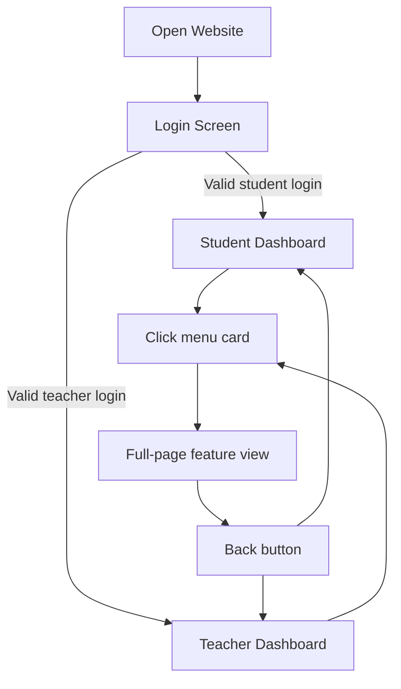

# Chinmaya Vidyalaya Bokaro Website Documentation

A prototype **school management system** built with HTML, CSS, and JavaScript. It offers separate portals for students and teachers. Some features remain placeholders. The UI uses vibrant gradients, animations, and a custom 3D logo.  

This project was created by **Aditya, Aarav, Virat, and Vaidik**, with strong support from an AI assistant.

## Prototype Status

This project is a **demo prototype**. It showcases core UI and navigation. Many features use sample data or simple placeholders.

```card
{
  "title": "Prototype Status",
  "content": "This is an early demo. Some features are not fully functional and serve as placeholders."
}
```

### What “Prototype” Means Here

- Data does not come from a real school server or database.  
- Marks, attendance, and students are **fake but realistic** examples.  
- Some menu items only show a “coming soon” message.  
- The design helps plan a real system that could be built later.

## Overview 🎓

The app provides:
- **Login** for students and teachers
- **Dashboards** with menu cards
- **Dynamic pages** for assignments, attendance, and more
- **Global search**, **toast notifications**, and **keyboard shortcuts**

It runs entirely in the browser and stores data in cookies/localStorage.

### Main Goals of This Website

- Show what a **modern school portal** can look like.  
- Practice real-world **front-end development skills**.  
- Let non-coders imagine daily usage, like checking homework.  
- Build a base that a real backend can connect to later.

## index.html

This file contains the **markup structure** and links to assets. It is the “skeleton” of the whole website.

### Key Sections

- `<head>`: Meta tags, Google Fonts, Font Awesome, `style.css`, favicon.  
- **Scroll progress bar**, **toast container**, and **keyboard shortcuts overlay**.  
- **Scroll-to-top** button and a **custom alert overlay**.  
- **Theme toggle** and **YouTube** quick-access button.  
- **Login page** with student/teacher selector and form.  
- **Student** and **Teacher** dashboards with menu grids.  
- **Full-page** containers for each feature.  
- **Change password** modal.  
- Scripts: `script.js` and `config.js`.

```html
<!DOCTYPE html>
<html lang="en">
<head>
  <meta charset="UTF-8">
  <meta name="viewport" content="width=device-width, initial-scale=1.0">
  <title>Chinmaya Vidyalaya</title>
  <link rel="stylesheet" href="style.css">
</head>
<body>
  <!-- Login, Dashboards, Overlays, Modals, etc. -->
  <script src="script.js"></script>
</body>
</html>
```

### Main HTML Blocks (Simplified)

| Block                       | Purpose                                 |
|----------------------------|-----------------------------------------|
| `.login-container`         | Login screen for students and teachers |
| `#studentDashboard`        | Student dashboard view                 |
| `#teacherDashboard`        | Teacher dashboard view                 |
| `.full-page` containers    | Individual pages like timetable, etc.  |
| `#changePasswordModal`     | Change password popup                  |
| Overlays/buttons (top)     | Search, shortcuts, alerts, theme, etc. |

### Navigation Flow

- User lands on **Login Page**.  
- On success, they see either **Student** or **Teacher** dashboard.  
- Clicking a menu card opens a **full-page** view.  
- A **Back** button returns to the dashboard.

### Simple User Journey (Visual)



## style.css

This stylesheet defines the app’s **visual theme**, layouts, and responsive behavior. It makes the site look modern and animated.

### CSS Variables

```css
:root {
  --primary:  #28378a;
  --secondary: #38f9d7;
  --tertiary: #a629b4;
  --success: #10b981;
  --danger:  #ef4444;
  --warning: #f59e0b;
  --info:    #3b82f6;
  --text-dark:  #1f2937;
  --bg-light:   #f9fafb;
  --transition-base: all 0.3s ease;
  /* …more… */
}
```

These variables power **colors**, **shadows**, and **transitions**.

### Component Styles

- **Reset & base**: Global margin, padding reset, smooth scrolling.  
- **Utility classes**: `.hidden`, `.visible`.  
- **Scroll progress bar** and **scroll-to-top** button styles.  
- **Quick-access** menu and **search overlay**.  
- **Toast notifications**, **shortcuts overlay**, **modals**.  
- **Buttons** (`.btn-primary`, `.btn-success`, etc.).  
- **Dashboard** header, **menu cards**, **full-page** layouts.  
- **Tables** for timetable, attendance, results.

### Design Highlights ✨

- Strong use of **gradients** to feel energetic and modern.  
- A glowing **ॐ circular logo** adds spiritual and school identity.  
- **Dark theme** support with a single toggle button.  
- Smooth **hover** and **bounce** animations for buttons and icons.

### Responsive & Print

- Breakpoints at **1024px**, **768px**, **480px** adjust grids, font sizes, and layout.  
- Layout rearranges for **mobile phones**, making cards stack vertically.  
- **Print styles** hide UI controls and adapt content for paper.

## script.js

This file implements **data**, **authentication**, **UI interactions**, and **page loaders**. It is the “brain” of the website.

### Data Initialization

- **In-memory DBs**: `studentDB`, `teacherDB`, `timetableDB`, `teacherSchedule`.  
- **Sample data** is auto-generated for 3-9th classes.  
- Persistent arrays: `assignmentsDB`, `homeworkDB`, `materialsDB`, `announcementsDB`, `eventsDB`.  
- **Cookies/localStorage** store user session and theme.

### Authentication Flow

1. **Login form** reads `userId` and `password`.  
2. It checks against `studentDB` or `teacherDB`.  
3. On success, it saves `currentUser` and `userType` in cookies.  
4. It shows the appropriate dashboard and a welcome toast.

### High-Level Interaction Flow

- After login, JavaScript decides which **dashboard** to show.  
- When the user clicks a menu card, it calls `openPage('pageName')`.  
- The function fills the matching `.full-page` container with **dynamic HTML**.  
- Helper functions update progress bars, tables, and summary cards.

### UI Interactions

- **Theme toggle**: Switches between light/dark modes.  
- **Toast notifications**: `showToast(message, type)`.  
- **Global search overlay** with live filtering.  
- **Keyboard shortcuts**:  

  | Action               | Keys           |
  |----------------------|----------------|
  | View Shortcuts       | `?`            |
  | Scroll to Top        | `↑ ↑`          |
  | Go to Dashboard      | `Ctrl + H`     |
  | Toggle Theme         | `Ctrl + Shift + T` |
  | Logout               | `Ctrl + L`     |
  | Print Page           | `Ctrl + P`     |
  | Close Overlays       | `Escape`       |

- **Custom alert** for simple modal messages.

### Page Loaders

Each feature uses a loader function that builds HTML dynamically:

- **Timetable**: `loadTimetable()` and `loadTeacherTimetable()`.  
- **Attendance**: `loadMarkAttendance()`, `loadClassStudents()`, `markAtt()`.  
- **Student Attendance**: `loadStudentAttendance()`.  
- **Results**: `loadStudentResults()`.  
- **Enter Marks**: `loadEnterMarks()`, `loadStudentsForMarks()`.  
- **Homework**: `loadHomework()`, `assignHomework()`.  
- **Study Materials**: `loadMaterials()`, `uploadMaterial()`.  
- **Assignments**: `loadCreateAssignment()`, `addQuestion()`, `publishAssignment()`, `loadStudentAssignments()`, `attemptAssignment()`, `submitAssignment()`.  
- **Events & Announcements**: `loadEvents()`, `loadAnnouncements()`.  
- **Certificates**, **Profile**, **Reports**, **Generic pages**, and **E-Diary** redirect.

### Example: Simple Cookie Helper

```js
function saveToCookie(name, data, days=365) {
  const expires = new Date(Date.now() + days*864e5).toUTCString();
  document.cookie = `${name}=${encodeURIComponent(JSON.stringify(data))};expires=${expires};path=/;SameSite=Lax`;
}
```

Even non-coders can read this as “save some data as a cookie for many days.”

### What Is Not Yet Real

- There is **no real login server**; passwords are stored in the browser.  
- Fee payment does not connect to any **payment gateway**.  
- Many “download” actions only show a **toast**, not a real file.  
- E-Diary redirects to an external ERP site instead of deep integration.

## How Non-Coders Can Think About It

This website behaves like a **simulation** of a real school portal. You can:
- Log in as a sample student or teacher.  
- Click through pages to imagine real daily tasks.  
- See how attendance, results, and homework might appear.  
- Understand the overall **experience** without caring about code.

You do not need to understand JavaScript to:
- Recognize which page shows **what information**.  
- Decide which features you like or dislike.  
- Suggest new features, like “add bus tracking” or “add SMS alerts.”

## Contribution & Credits 🙏

The **first version** emerged from an AI assistant. Our team then manually refined, extended, and optimized it.  
Overall, roughly **50%** of the code was AI-generated and **50%** was handcrafted.

```card
{
  "title": "AI & Manual Work",
  "content": "Initial prototype was AI-generated. We added new features, polished UI, and fixed logic."
}
```

### Who Built It

- **Aditya**
- **Aarav**
- **Virat** 
- **Vaidik**

Together, **Aditya, Aarav, Virat, and Vaidik** used AI as a helper, not a replacement. They wrote and edited a large part of the code themselves.

## Conclusion ✔️

This prototype highlights a **creative UI** and **modular structure**. It runs entirely client-side and uses cookies for persistence. Future work can integrate a backend, real databases, and payment gateways to complete all features.  

It stands as a **student-led project** by Aditya, Aarav, Virat, and Vaidik, honestly combining **human effort and AI assistance** to imagine the future Chinmaya Vidyalaya Bokaro portal.
